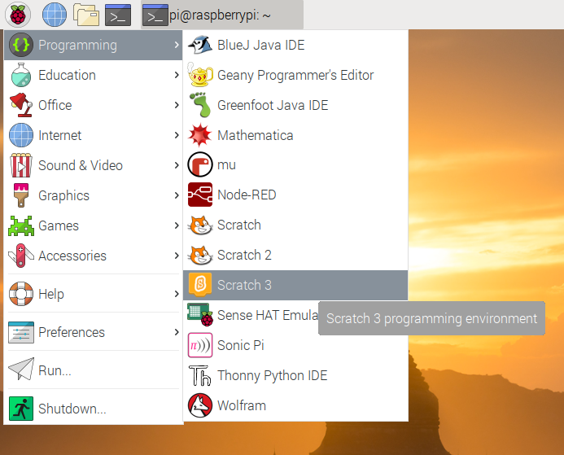

To open up Scratch 2 on the Raspberry Pi:

- Click on the `Menu` in the top left corner of the screen.

- Hover your mouse pointer over `Programming`.

- Select `Scratch 2` from menu

	

- Your program should open in a few seconds.

![open scratch animation(images/open-scratch.gif)
