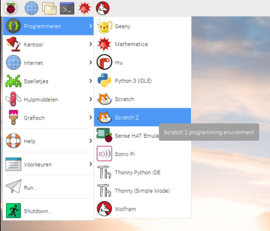

To open up Scratch 3 on the Raspberry Pi:

- Klik op het menupictogram in de linkerbovenhoek van het scherm.

- Beweeg je muisaanwijzer over **Programmeren**.

- Select **Scratch 3** from the menu that appears.
    
    

- Je toepassing zou in een paar seconden moeten openen.
    
    